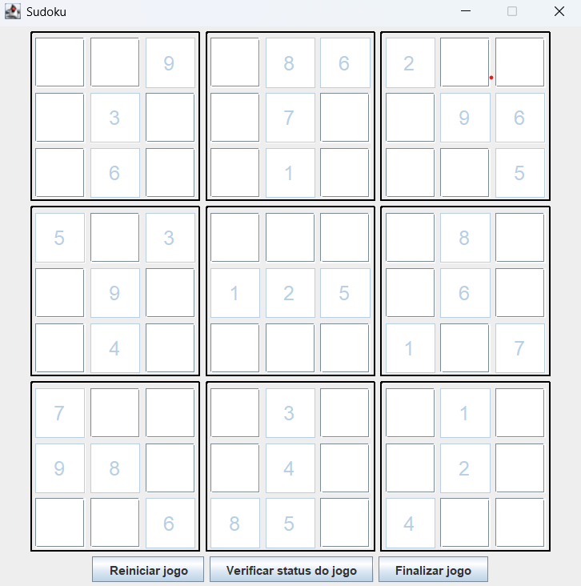

## 💜 Sudoku Game

Este projeto é uma aplicação desktop de Sudoku desenvolvida em **Java**, utilizando **Swing** para a interface gráfica. O objetivo é permitir que o(a) usuário(a) jogue Sudoku diretamente na interface, com recursos de validação, reinício e conclusão de partida.

---

### 🖼️ Interface



---

### 🚀 Tecnologias Utilizadas

* **Java 17+**
* **Swing (javax.swing)** – Interface gráfica
* **Programação Orientada a Objetos**
* **Stream API**
* **Boas práticas de encapsulamento, separação de responsabilidades e imutabilidade onde possível**

---

### 📁 Estrutura do Projeto

```
src/
├── me/dio/
│   ├── model/              # Modelos de dados, como Space
│   ├── service/            # Lógica de negócios e serviços (BoardService, NotifierService)
│   └── ui/custom/          # Componentes de UI personalizados
│       ├── button/         # Botões como "Finalizar", "Verificar" e "Resetar"
│       ├── frame/          # JFrame principal
│       ├── input/          # Inputs personalizados como NumberText
│       ├── panel/          # Painéis visuais (ex: setores do tabuleiro)
│       └── screen/         # Tela principal da aplicação
```

---

### 🎮 Funcionalidades

* ✅ Interface gráfica com layout dividido por setores 3x3 do Sudoku.
* 🔢 Preenchimento interativo de células com validação de números.
* 🧹 Botão **Resetar Jogo** para recomeçar do zero.
* ✅ Botão **Verificar Status** para saber se o jogo está completo ou incorreto.
* 🏑 Botão **Finalizar Jogo** com feedback caso o Sudoku esteja corretamente resolvido.
* 🔐 Células fixas (pré-preenchidas) não podem ser modificadas pelo usuário.

---

### ⚙️ Como Executar

1. Clone este repositório:

   ```bash
   git clone https://github.com/dantaspereiraana/desafio-sudoku.git
   ```

2. Compile o projeto:
   Você pode usar uma IDE como IntelliJ ou Eclipse, ou compilar via terminal:

   ```bash
   javac -d out src/me/dio/**/*.java
   ```

3. Execute a aplicação:

   ```bash
   java -cp out me.dio.UIMain "<coordenada>;<valor>;<fixo>" ...
   ```

   Exemplo de configuração inicial:

   ```bash
   0,0;4,false 1,0;7,false 2,0;9,true 3,0;5,false 4,0;8,true 5,0;6,true 6,0;2,true 7,0;3,false 8,0;1,false 0,1;1,false 1,1;3,true 2,1;5,false 3,1;4,false 4,1;7,true 5,1;2,false 6,1;8,false 7,1;9,true 8,1;6,true 0,2;2,false 1,2;6,true 2,2;8,false 3,2;9,false 4,2;1,true 5,2;3,false 6,2;7,false 7,2;4,false 8,2;5,true 0,3;5,true 1,3;1,false 2,3;3,true 3,3;7,false 4,3;6,false 5,3;4,false 6,3;9,false 7,3;8,true 8,3;2,false 0,4;8,false 1,4;9,true 2,4;7,false 3,4;1,true 4,4;2,true 5,4;5,true 6,4;3,false 7,4;6,true 8,4;4,false 0,5;6,false 1,5;4,true 2,5;2,false 3,5;3,false 4,5;9,false 5,5;8,false 6,5;1,true 7,5;5,false 8,5;7,true 0,6;7,true 1,6;5,false 2,6;4,false 3,6;2,false 4,6;3,true 5,6;9,false 6,6;6,false 7,6;1,true 8,6;8,false 0,7;9,true 1,7;8,true 2,7;1,false 3,7;6,false 4,7;4,true 5,7;7,false 6,7;5,false 7,7;2,true 8,7;3,false 0,8;3,false 1,8;2,false 2,8;6,true 3,8;8,true 4,8;5,true 5,8;1,false 6,8;4,true 7,8;7,false 8,8;9,false
   ```

   As configurações definem a posição inicial de números do tabuleiro.

---

### 📌 Possíveis Melhorias Futuras

* 📀 Persistência de jogo salvo
* 🌐 Versão web com JavaFX ou frameworks modernos
* 🧠 Algoritmo de sugestão de movimentos válidos
* 🎨 Customização de temas e aparência

---

### 👩‍💼 Autora

**Ana Paula Dantas**
Estudante de Análise e Desenvolvimento de Sistemas e Letras na Universidade Católica de Santos.
Focada em desenvolvimento backend com Java e explorando o mundo do frontend com Angular.
